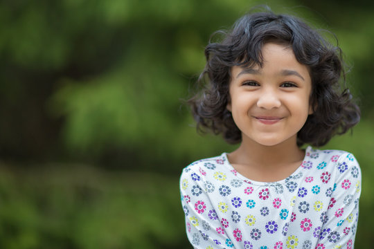
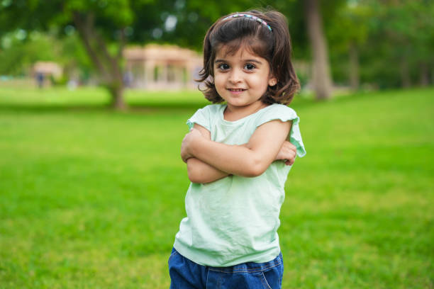

# Passport Photo Generator - High-Accuracy Background Removal and Body Position Detection

**Passport Photo Generator** is a powerful tool that combines **RMBG v1.4** background removal with **MediaPipe** body position detection to create perfect passport-style photos with customizable background colors. This tool is ideal for **ID photos**, **passport applications**, and other official photo requirements, offering reliable, high-quality results.

## Key Features
- **Accurate Background Removal**: Leverages the RMBG v1.4 model, which has been trained on over 12,000 high-quality images, to cleanly separate subjects from backgrounds.
- **Precise Body Position Detection**: Utilizes MediaPipe to accurately detect body alignment, ensuring consistent framing and compliance with photo standards.
- **Customizable Background Color**: Allows users to set a background color, perfect for matching official photo requirements or personal preferences.
- **Simple Workflow**: User-friendly script with easy-to-follow steps for image processing and editing.

## How It Works
1. **Background Removal**: RMBG v1.4 isolates the subject from the original background with precision.
2. **Body Position Detection**: MediaPipe detects key points on the body to assist in positioning and cropping, ensuring the subject is centered and properly scaled.
3. **Custom Background Application**: The tool applies the desired background color to the processed image, resulting in a high-quality, passport-ready photo.

---

## Image Comparison: Input vs. Output 

<table>
  <tr>
    <td><strong>Input Image</strong></td>
    <td><strong>Output Image</strong></td>
  </tr>
  <tr>
    <td></td>
    <td></td>
  </tr>
    <tr>
    <td></td>
    <td></td>
  </tr>
    <tr>
    <td></td>
    <td></td>
  </tr>
    <tr>
    <td></td>
    <td></td>
  </tr>
</table>

---

### Installation

1. Clone the repository to your local machine:
   ```bash
   git clone https://github.com/biplob004/AIPassportPhotoGenerator
   ```
2. Navigate into the project directory:
   ```bash
   cd AIPassportPhotoGenerator
   ```
3. Install the necessary dependencies:
   ```bash
   pip install -r requirements.txt
   ```

---

### Usage Instructions

1. **Specify Image Paths**:
   - Set the **Input Image Path** in `main.py` .
   - Define the **Output Image Path** for the generated passport photo.

2. **Configure Background Color**:
   - Update the **Background Color** setting in `main.py` to your desired color (in RGB format) for the passport photo.

3. **Run the Script**:
   Execute the following command to generate the passport photo:
   ```bash
   python main.py
   ```

The final image will be saved at your specified output path.

---

### License Information

This project is available under a **non-commercial license**. You may use it for personal and educational purposes. For commercial usage, please contact **BRIA AI** to obtain a separate license agreement.

Explore the power of **RMBG** and **MediaPipe** in your applications today!
